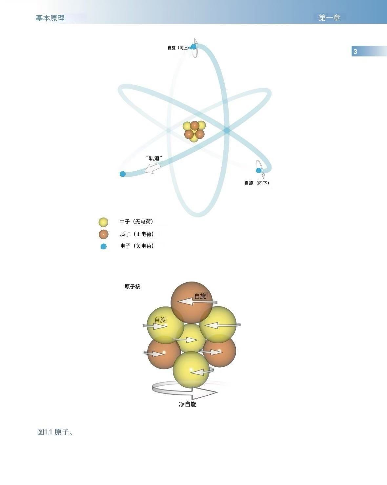

## 原子结构

所有物质都是由原子构成的。原子组成分子，分子是两个或更多原子的排列组合。人体中最丰富的原子是氢原子，但还有其他元素如氧、碳和氮。氢最常见于水分子中（两个氢原子与一个氧原子结合；H2O）和脂肪分子中（氢原子与碳和氧原子结合；具体数量取决于脂肪的类型）。

原子由中心核和围绕其运行的电子组成（图1.1）。原子核非常小，仅占原子总体积的十亿分之一，但它包含了原子的所有质量。这个质量主要来自称为核子的粒子，核子又分为质子和中子。原子有两种特征：

• 原子序数是原子核中质子的总数。这个数字决定了原子的化学特性。  
• 质量数或原子量是原子核中质子和中子的总数。

原子核中的中子和质子数量通常是平衡的，因此质量数通常是偶数。但在某些原子中，中子数量可能略多于或少于质子数量。具有相同质子数但中子数不同的元素原子被称为同位素。

电子是围绕原子核旋转的粒子。传统上，这被类比为行星围绕太阳运行，电子在特定的壳层中运动。然而，根据量子理论，电子的位置是不可预测的，因为它取决于电子在任意时刻的能量（这被称为海森堡不确定性原理，**Heisenberg’s Uncertainty Principle**）。

原子中的一些粒子带有电荷。质子带正电荷，中子不带电荷，电子带负电荷。如果带负电荷的电子数量等于带正电荷的质子数量，原子就处于电学稳定状态。有时通过施加能量可以击出原子中的电子，这会改变这种平衡。这会导致电子数量少于质子数量，造成电学不稳定。发生这种情况的原子被称为离子，击出电子的过程被称为电离。

## 原子中的运动

原子中存在三种类型的运动（图1.1）：  
• 电子绕自身轴旋转  
• 电子围绕原子核运行  
• 原子核自身绕轴旋转

MRI（磁共振成像）的原理依赖于生物组织中特定原子核的旋转运动。根据原子序数和质量数，旋转值有有限的数量。如果原子具有偶数原子序数和质量数（例如六个质子和六个中子，质量数为12），则原子核没有旋转。在由偶数质子和中子组成的偶数质量数原子核中，一半的核子向一个方向旋转，另一半向相反方向旋转。旋转力相互抵消，原子核本身没有净旋转。

然而，在具有奇数质子数、奇数中子数，或同时具有奇数质子和中子数的原子核中，旋转方向并不相等且相反，因此原子核本身具有净旋转或角动量。通常，这些是具有奇数质子数（或奇数原子序数）的原子核，因此具有奇数质量数。这意味着它们的旋转具有半整数值，例如½、5/2。然而，这种现象也发生在同时具有奇数质子和中子数，导致偶数质量数的原子核中。这意味着它具有整数值的旋转，例如1、2、3。例子包括锂-6（由三个质子和三个中子组成）和氮-14（七个质子和七个中子）。然而，这些元素在MRI中基本上无法观察到，因此，一般来说，只使用具有奇数质量数或原子量的原子核。这些被称为MR活性核（MR-active nuclei）。