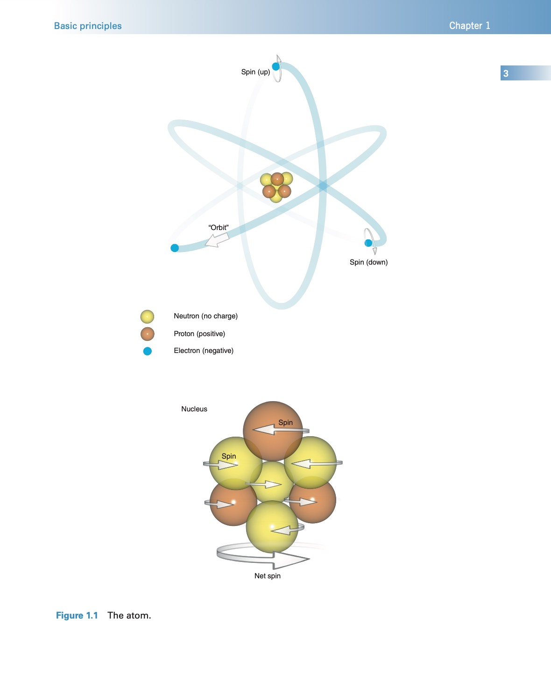

## Atomic structure

All things are made of **atoms**. Atoms are organized into **molecules**, which are two or more atoms arranged together. The most abundant atom in the human body is **hydrogen**, but there are other elements such as oxygen, carbon, and nitrogen. Hydrogen is most commonly found in molecules of water (where two hydrogen atoms are arranged with one oxygen atom; H2O) and fat (where hydrogen atoms are arranged with carbon and oxygen atoms; the number of each depends on the type of fat).

The atom consists of a central nucleus and orbiting electrons (Figure 1.1). The nucleus is very small, one millionth of a billionth of the total volume of an atom, but it contains all the atom’s mass. This mass comes mainly from particles called nucleons, which are subdivided into protons and neutrons. Atoms are characterized in two ways.

- The atomic number is the sum of the protons in the nucleus. This number gives an atom its chemical identity.
- The mass number or atomic weight is the sum of the protons and neutrons in the nucleus.

The number of neutrons and protons in a nucleus is usually balanced so that the mass number is an even number. In some atoms, however, there are slightly more or fewer neutrons than protons.  
Atoms of elements with the same number of protons but a different number of neutrons are called isotopes.

Electrons are particles that spin around the nucleus. Traditionally, this is thought of as analogous to planets orbiting around the sun with electrons moving in distinct shells. However, according to quantum theory, the position of an electron is not predictable as it depends on the energy of an individual electron at any moment in time (this is called Heisenberg’s Uncertainty Principle).  
Some of the particles in the atom possess an electrical charge. Protons have a positive electrical  
charge, neutrons have no net charge, and electrons are negatively charged. Atoms are electrically stable if the number of negatively charged electrons equals the number of positively charged protons. This balance is sometimes altered by applying energy to knock out electrons from the  
atom. This produces a deficit in the number of electrons compared with protons and causes  
electrical instability. Atoms in which this occurs are called ions and the process of knocking out  
electrons is called ionization.

## Motion in the atom

Three types of motion are present within the atom (Figure 1.1):

- Electrons spinning on their own axis
- Electrons orbiting the nucleus
- The nucleus itself spinning about its own axis.

The principles of MRI rely on the spinning motion of specific nuclei present in biological tissues. There are a limited number of spin values depending on the atomic and mass numbers. A nucleus has no spin if it has an even atomic and mass number, e.g. six protons and six neutrons, mass number 12. In nuclei that have an even mass number caused by an even number of protons and neutrons, half of the nucleons spin in one direction and half in the other. The forces of rotation cancel out, and the nucleus itself has no net spin.

However, in nuclei with an odd number of protons, an odd number of neutrons, or an odd number of both protons and neutrons, the spin directions are not equal and opposite, so the nucleus itself has a net spin or angular momentum. Typically, these are nuclei that have an odd number of protons (or odd atomic number) and therefore an odd mass number. This means that their spin has a half-integral value, e.g. ½, 5/2. However, this phenomenon also occurs in nuclei with an odd number of both protons and neutrons resulting in an even mass number. This means that it has a whole integral spin value, e.g. 1, 2, 3. Examples are 6lithium (which is made up of three protons and three neutrons) and 14nitrogen (seven protons and seven neutrons). However, these elements are largely unobservable in MRI so, in general, only nuclei with an odd mass number or atomic weight are used. These are known as MR-active nuclei.

